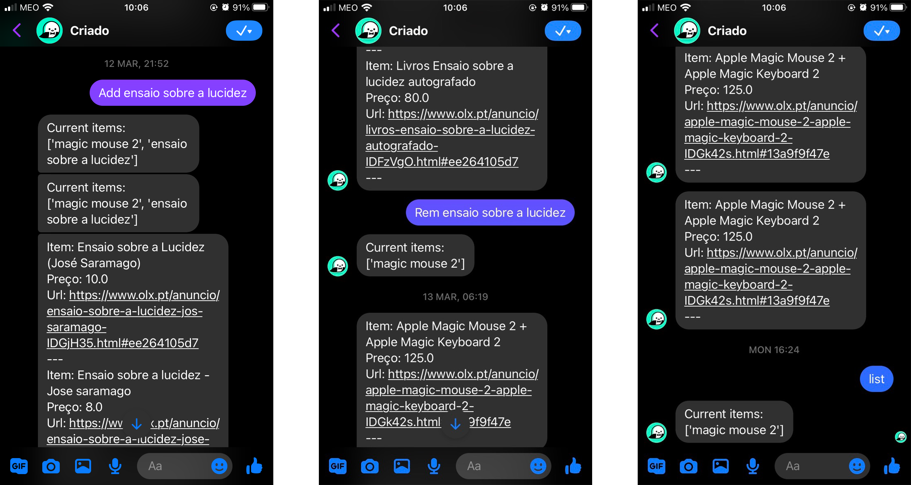
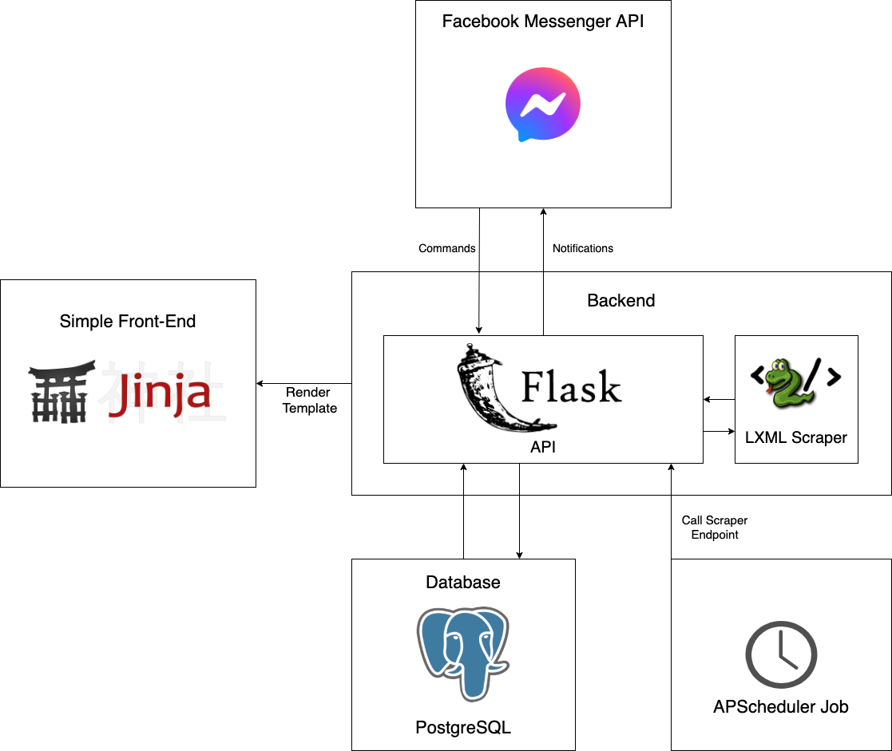

# criado-olx

A bot that:

* Scrapes OLX.pt for items on my wishlist periodically.
* Sends a message through Facebook Messenger when it finds a new ad matching an item in my wishlist (or when the price
  of an old ad decreases)
* Is controlled via Facebook Messenger
* Supports multiple users (e.g. user A won't get notified of items on user B's wishlist)

